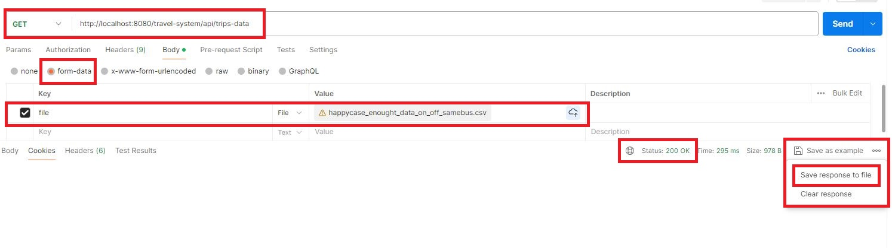
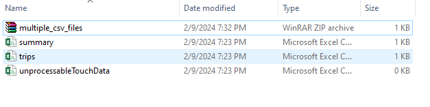

# Approach and Solution
### Assumption
````
- Any record with touch OFF status without touch ON before will be unprocessable record
- Any record has data cell value null/empty will be unprocessable record
````
### Solution
````
Pre-condition
 - Trip amount determined, in yml config format such as:
 {
    "StopA_TO_StopB": 4.50,
    "StopB_TO_StopC": 6.25,
    "StopA_TO_StopC": 8.45
 }
 config service will load that config cost and do add more reversed pairs to make sure TripA -> TripB = TripB -> TripA
 we will have mapping like below:
    "StopA_TO_StopB": 4.50
    "StopB_TO_StopC": 6.25
    "StopA_TO_StopC": 8.45
    "StopB_TO_StopA": 4.50
    "StopC_TO_StopB": 6.25
    "StopC_TO_StopA": 8.45
````
````
Code flow
1. Read raw data from file
2. Map each row to TouchRecord object
3. Filter TouchRecord what can be continue to calculate, 
and sort those record by starttime and PAN to get a sorted list in order startime and PAN
4. Grouping that list, to easier working, every record belong to a PAN will be in the same list
5. After step 4 & 5, we have a grouping of in ordered records for each PAN.
	Purpose:
	 - that order will make ON/OFF touch in time order, (touch ON should be before touch OFF)
	 - make sure each PAN`s records just belong to one PAN
6. Calculate bus fee for each PAN base on PAN`s records touch ON/OFF
	Rule are:
		1. A touchOnRecord should has touchOffRecord (next to touchOnRecord)
		2. If next to touchOnRecord is not touchOffRecord, will be Incomplete record, and cost = maximum cost
		3. If touchOnRecord has status OFF, that mean this is a touchOffRecord without touchOn, shoule be unprocessable trip
		
7. After having trips infomation, traverse this trips list to calculate summary infomation, which has the number of complete, incomplete and cancelled trips along with total charges, sorted and grouped by Date, CompanyId and BusID
8. After have trips, unprocessable data, summary, generate 3 csv files
````
# Requisites
````
- Java 11
- Maven
- OS: Window or Linux
````
# Getting Started
mvn clean package

# Curl
````
curl --location --request GET 'http://localhost:8080/travel-system/api/trips-data'
````
# Using postman to test
````
Test data folder
    `trelleborg\src\main\resources\csv_test_data`
Call GET: travel-system/api/trips-data api
    
Choose 'Save response to file' result (multiple_csv_files zip file), then extract it, will be 3 files result

````

